# PBL5-Solaris
 

## Screenshots

[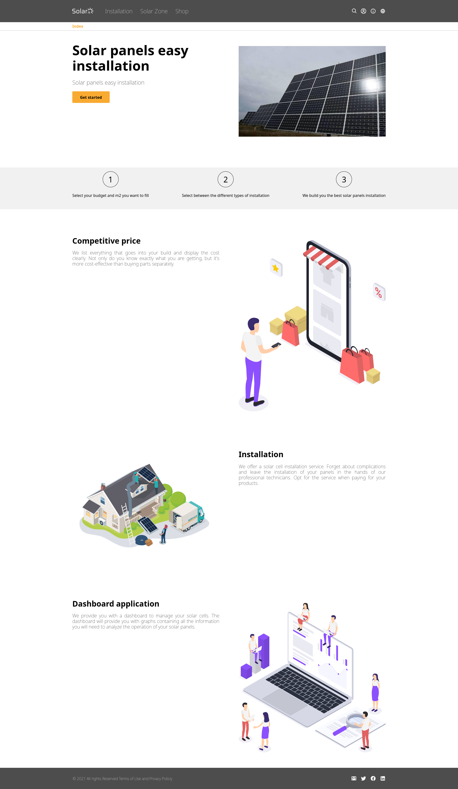](screenshots/shot_01.png)
[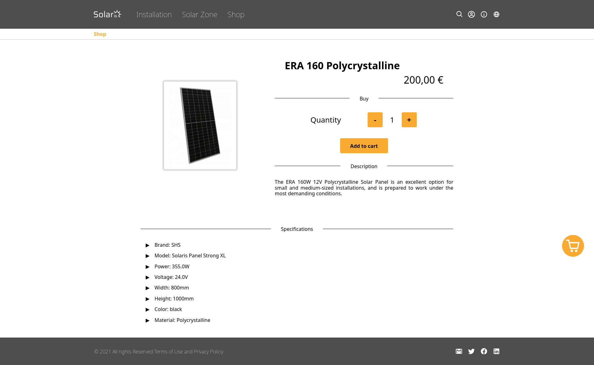](screenshots/shot_02.png)
[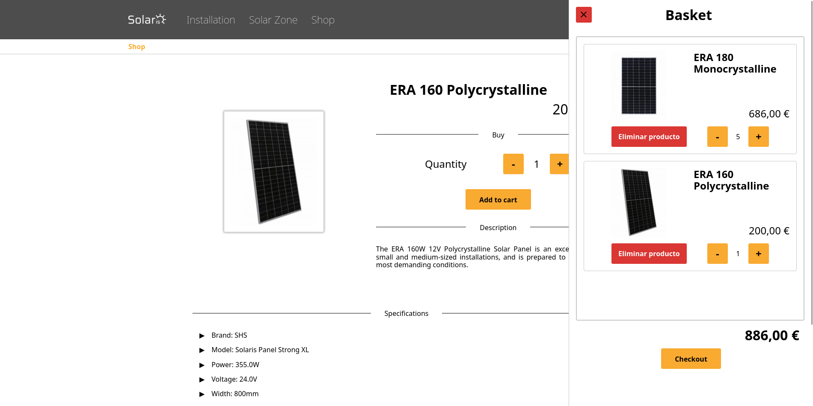](screenshots/shot_03.png)
[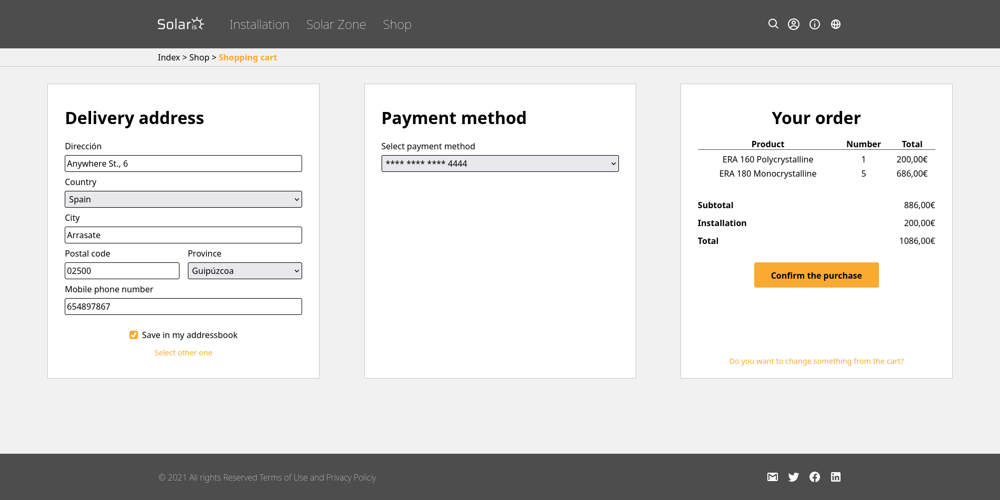](screenshots/shot_04.png)
[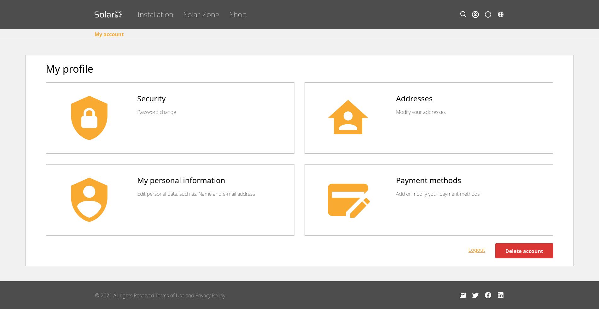](screenshots/shot_05.png)
[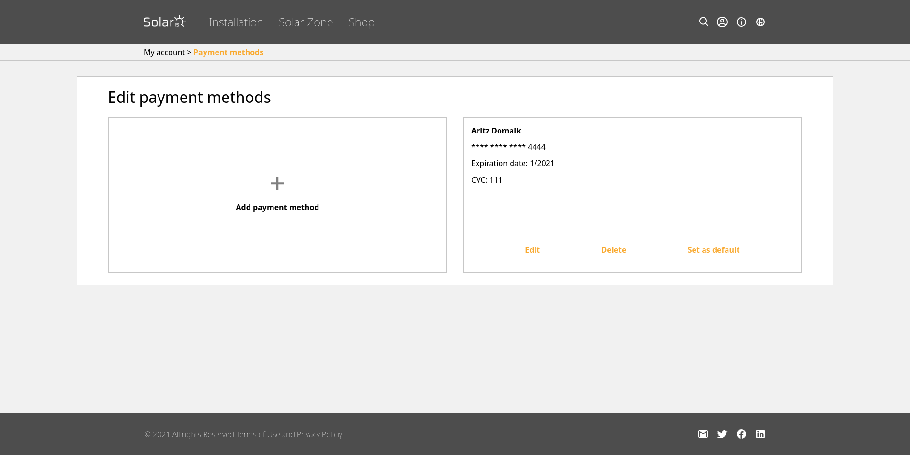](screenshots/shot_06.png)
[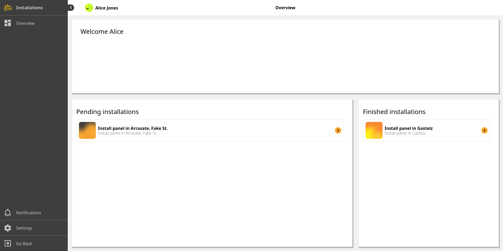](screenshots/shot_07.png)
[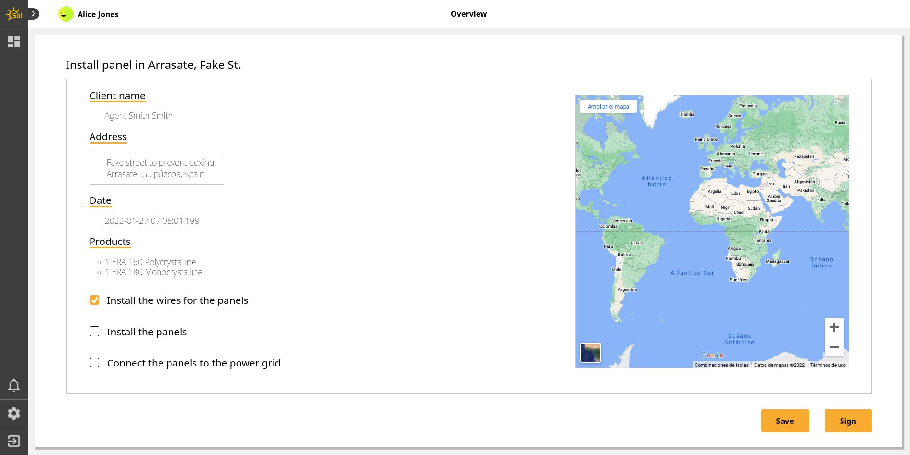](screenshots/shot_08.png)
[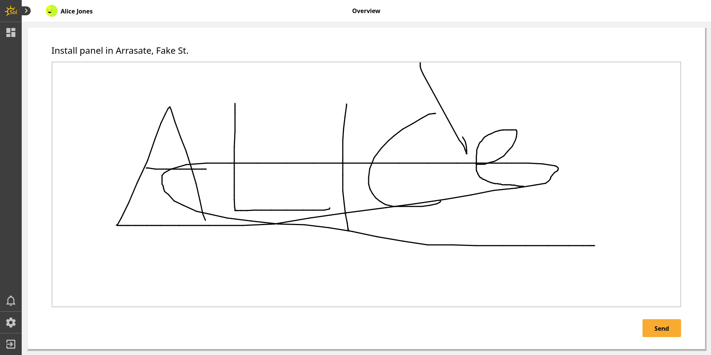](screenshots/shot_09.png)
[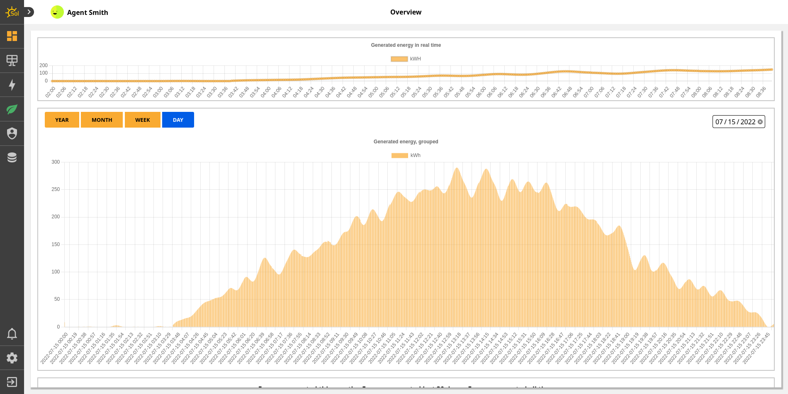](screenshots/shot_10.png)
[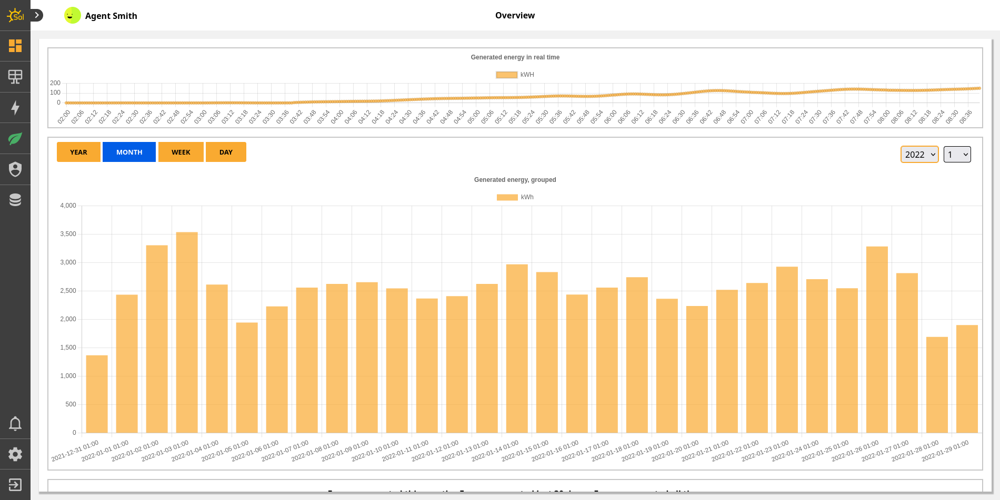](screenshots/shot_11.png)
[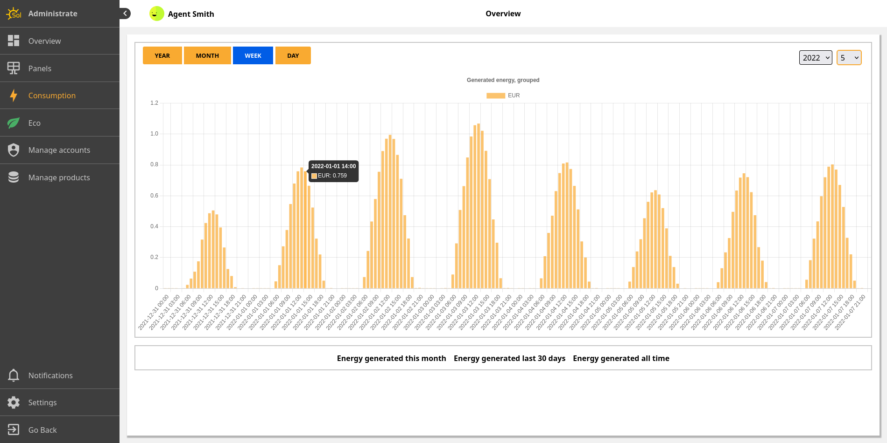](screenshots/shot_12.png)
[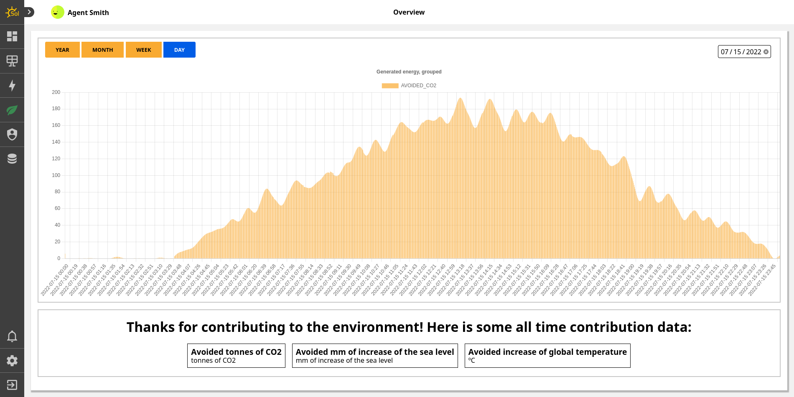](screenshots/shot_13.png)
[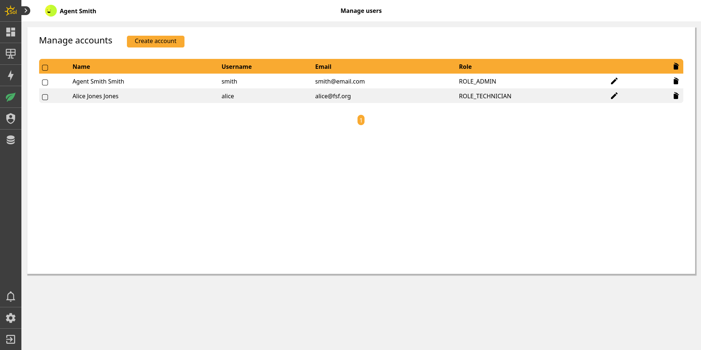](screenshots/shot_14.png)
[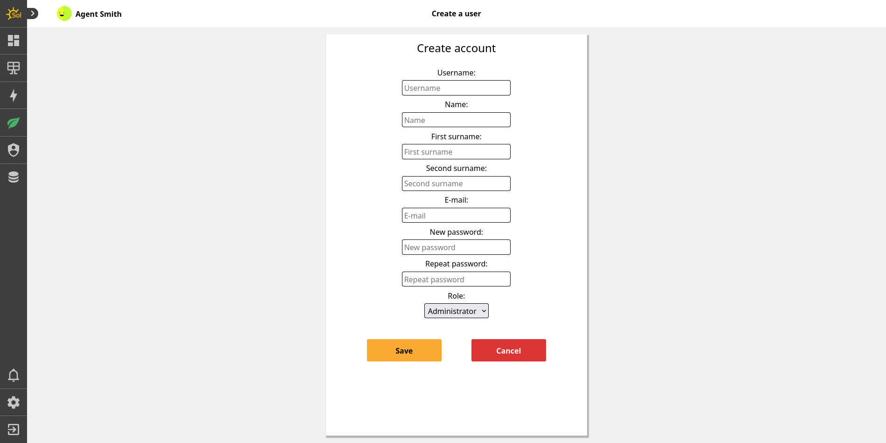](screenshots/shot_15.png)
[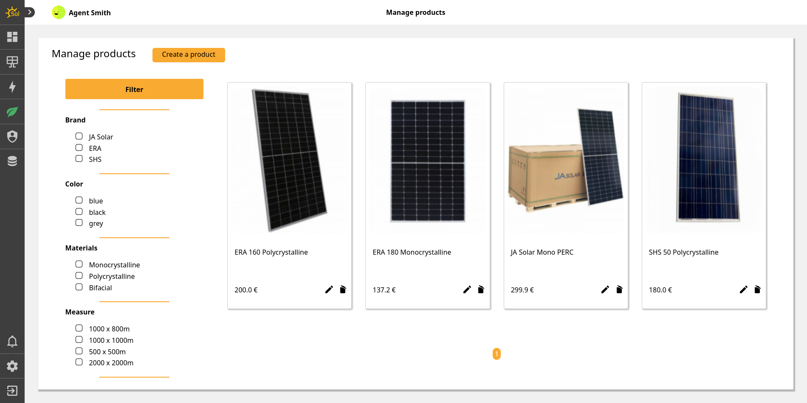](screenshots/shot_16.png)
[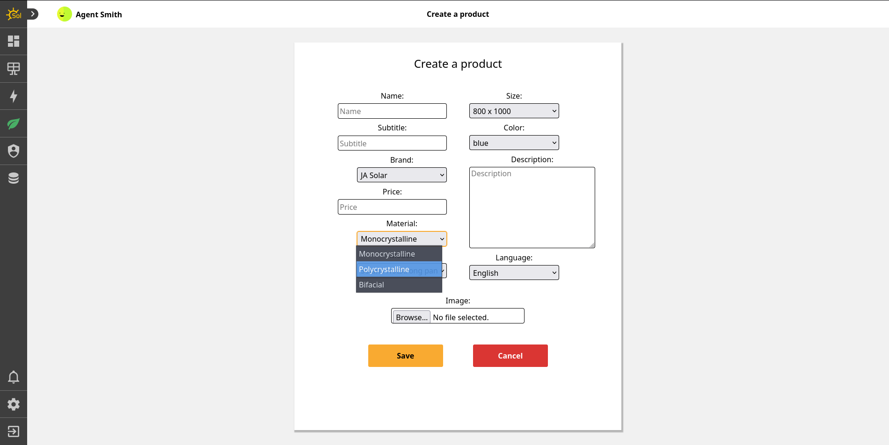](screenshots/shot_17.png)